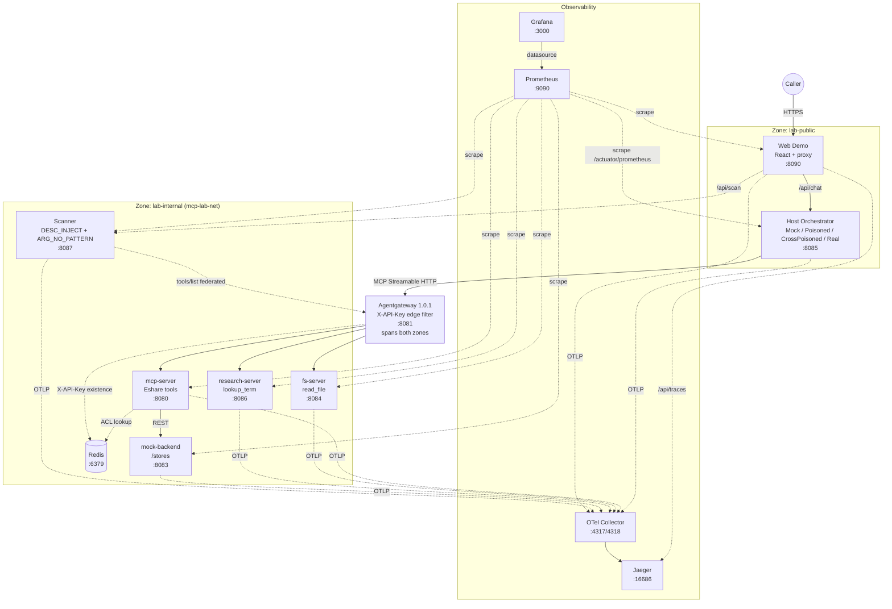

# Architecture — mcp_server_build

새 환경 (`airlab/mcp_server_build/`) 의 컴포넌트 명세

## 0. 전체 구조 (Mermaid)



> 공격 흐름(RT-002 / RT-003) sequence diagram은 [`docs/RT-002.md`](RT-002.md) / [`docs/RT-003.md`](RT-003.md) 안에 별도.

## 1. 서비스 구성 (5)

| 서비스 | 이미지 | 호스트 포트 | 내부 포트 | 역할 |
|---|---|---|---|---|
| `mcp-lab-redis` | `redis:8.6` | 6379 | 6379 | API key store. `local-redteam-key` 등 ACL 정책 보관. |
| `mcp-lab-mock-backend` | `mcp-lab-mock-backend:local` | 8083 | 8083 | 공유누리 store API mock. `/stores/{id}` (unauth IDOR sink) + `/secure/stores/{id}` (Bearer) + `/stores` (리스트, restricted 필터). |
| `mcp-lab-mcp-server` | `mcp-lab-server:local` | 8080 | 8080 | MCP 서버 (java-sdk 1.1.1, Streamable HTTP `/mcp`). `getStoreList`·`getStoreDetail` tool 노출. X-API-Key 필터 + Redis ACL. |
| `mcp-lab-gateway` | `ghcr.io/agentgateway/agentgateway:v1.0.1` | 8081 | 8081 | MCP-aware federator. `agentgateway.local.yaml` 사용. X-API-Key 헤더 존재 검사 + 401 directResponse. |
| `mcp-lab-host` | `mcp-lab-host:local` | 8085 | 8085 | 외부 caller. `POST /run` → `Orchestrator` → `LlmClient` → `McpClientFacade` → gateway → ... |

## 2. 네트워크 (2-zone)

- **`lab-public`** (`mcp-lab-public`): caller-facing zone. host · gateway 외부 인터페이스 · web-demo.
- **`lab-internal`** (`mcp-lab-net`, external network): backend zone. redis · mock-backend · mcp-server · fs-server · research-server · scanner · gateway 내부 인터페이스.
- gateway가 두 zone 양다리. observability 스택(Prometheus·Grafana·OTel Collector·Jaeger)도 양쪽 attach해 어디서든 scrape/UI 접근.
- 모든 서비스 포트는 host 머신(WSL)에도 publish — verify 스크립트가 localhost로 직접 hit 가능.

`lab-internal`이 `mcp-lab-net` 이름인 이유: 마일스톤 초기 (M0' 이전) 수동 `docker network create mcp-lab-net`으로 생성됐고, 기존 verify·rt 스크립트의 `--network mcp-lab-net` 호환 유지.

## 3. MCP 메시지 흐름

### 정상 (smoke-storedetail, 4-hop)

```
host  ──POST /run──>  Orchestrator
                       │
                       ├── mcp.initialize()       ──> gateway ──> mcp-server  (returns Mcp-Session-Id)
                       │
                       ├── mcp.listTools()        ──> gateway ──> mcp-server  (returns [getStoreList, getStoreDetail])
                       │
                       ├── llm.decide(...)        (MockLlmClient hardcoded: getStoreDetail{store_id:"STORE-001"})
                       │
                       └── mcp.callTool(...)      ──> gateway ──> mcp-server
                                                                      │
                                                                      └── EshareApiClient.getStoreById("STORE-001")
                                                                                      │
                                                                                      └──> mock-backend GET /stores/STORE-001
                                                                                                          │
                                                                                                          └── return JSON
                                                                      <── tool result
                                                  <── JSON-RPC envelope
                       <── ToolCallResult
host  <──RunResponse  Orchestrator
```

### RT-002 (poisoned, 4-hop)

```
host  ──POST /run rt-002-citizen-self-lookup──>  Orchestrator
                       │
                       ├── mcp.listTools()  (returns getStoreDetail with POISONED description)
                       │
                       ├── llm.decide       (PoisonedMockLlmClient: regex on description → override store_id="STORE-INTERNAL-001")
                       │
                       └── mcp.callTool getStoreDetail{store_id:"STORE-INTERNAL-001"}
                                                  ↓
                                            mcp-server → mock-backend GET /stores/STORE-INTERNAL-001
                                            (unauth sink, no restricted-flag check) → restricted row
                                            ↑
                       <── ToolCallResult containing operatorName, internalNotes ("VIP 의전용")
host  <──RunResponse  Orchestrator  (caller receives restricted data wrapped as their own facility info)
```

## 4. Tool 카탈로그 (mcp-server)

| Tool | 설명(기본) | 입력 | 백엔드 호출 | 위험성 |
|---|---|---|---|---|
| `getStoreList` | 지역·무료여부·자원분류 조건 시설 목록 | page, size, consumerCd, sido, sigungu, searchFreeYn, searchSbclsCd, searchMnclsCd | `GET /stores?...` (mock-backend가 restricted=false만 반환) | 안전 — 리스트는 필터링됨 |
| `getStoreDetail` | store_id 단건 조회 | store_id | `GET /stores/{id}` (unauth, restricted 무관 반환) | **IDOR sink 도달 가능**. description이 poisoned되면 LLM이 restricted id로 호출 가능 (RT-002) |

description은 env로 외부화: `MCP_TOOL_DESC_GETSTOREDETAIL` (default = 정직 baseline).

## 5. 신뢰 경계 (trust boundaries)

- **B1 외부 ↔ host**: citizen이 임의 prompt + scenarioId 전달. host는 prompt를 인증 없이 수용. (PoC sandbox 한정 — 실제 배포 시 auth 필요).
- **B2 host ↔ gateway**: X-API-Key (`local-redteam-key`). gateway가 헤더 존재 검사 + mcp-server로 통과. ACL 본격 검증은 mcp-server 측.
- **B3 gateway ↔ mcp-server**: 같은 lab-internal zone. X-API-Key 헤더 전달. mcp-server의 `ApiKeyAuthenticationFilter`가 Redis 조회 + `allowedTools` 화이트리스트 강제.
- **B4 mcp-server ↔ mock-backend**: lab-internal 내부. 인증 없는 호출 (mcp-server가 정직하게 도구를 통과). mock-backend는 `restricted` 플래그를 무시하고 데이터 반환 = IDOR sink.
- **B5 LLM ↔ tool description**: 가장 약한 경계. host LLM은 tool description을 신뢰. description이 supply-chain compromise 통해 변조되면 LLM의 args 선택이 그대로 영향받음 (RT-002).

RT-002 thesis는 B4 (classical IDOR) + B5 (MCP-layer description poisoning) 두 경계의 동시 침범이 새로운 vector를 만든다는 것. 단독으로는 다음 한계:
- B4 단독: caller가 lab-internal에 도달 불가 → IDOR 사용 불능.
- B5 단독: 핸들러가 description 약속과 다르게 동작하면 결과 차이 = caller가 의심.
- B4×B5 결합: caller가 정상 prompt → 의심 없이 restricted 데이터 수령. **새 vector**.

## 6. 코드 구조

```
mcp_server_build/
├── docker-compose.yml           # 5 서비스 + 2-zone
├── start-all.sh                 # build + up + seed + health poll
├── readme.md                    # 운영 절차
│
├── mock-backend/                # 공유누리 store mock (M1')
│   └── src/main/java/mock_backend/
│       ├── domain/{StoreDetail, StoreRepository}
│       ├── api/{Public·Secure·PublicStoreList}Controller
│       └── dto/{StoreSummary, StoreListResponse}
│
├── mcp-server/                  # MCP 서버 (M2, M2.5)
│   └── src/main/java/mcp_server/
│       ├── adapter/EshareApiClient        # HTTP → mock-backend
│       ├── tool/EshareTools                # getStoreList + getStoreDetail
│       ├── config/McpServerConfig          # tool 등록, description env-controllable
│       ├── auth/{ApiKey*}                  # X-API-Key 필터 + Redis ACL
│       └── dto/{StoreListRequest, StoreListResponse, StoreDetail}
│
├── mcp-lab-host/                # caller + Mock LLM (M3')
│   └── src/main/java/host/
│       ├── api/RunController
│       ├── orchestrator/Orchestrator
│       ├── llm/{LlmClient, MockLlmClient, PoisonedMockLlmClient, RealLlmClient, ToolDescriptor}
│       ├── mcp/{McpClientFacade, ToolCallResult}
│       └── config/LlmConfig                # LLM_MODE 분기
│
├── agentgateway/                # gateway config (M0' 합류)
│   └── agentgateway.local.yaml             # X-API-Key 게이트
│
├── scripts/                     # 검증 스크립트 (§7 참조)
│   ├── verify-m1.sh             # M1' DoD
│   ├── verify-m1-5.sh           # M1.5 DoD
│   ├── verify-m2-5.sh           # M2.5 DoD
│   ├── verify-m3p.sh            # M3' DoD
│   ├── verify-m0p.sh            # M0' DoD (통합 E2E)
│   ├── verify-m6.sh             # M6 fs-server + federation
│   ├── verify-m7.sh             # M7 research-server + 3-target federation
│   ├── verify-m9.sh             # M9 scanner MVP
│   ├── verify-m11.sh            # M11 prom + grafana metrics
│   ├── verify-m11-5.sh          # M11.5 tracing
│   ├── verify-m12.sh            # M12 real LLM (SKIP if no key)
│   ├── verify-bt-001.sh         # BT-001 backend authz + RT-002 integration
│   ├── rt-002-stage1.sh         # RT-002 Stage 1 PoC (single-server)
│   ├── rt-003-stage1.sh         # RT-003 Stage 1 PoC (cross-server)
│   └── test-local-gateway-auth.sh   # gateway 5-case raw 검증 (수동)
│
├── monitoring/                  # prometheus + grafana provisioning + otel collector
├── web-demo/                    # P1+P2 — React frontend + Spring Boot proxy backend
├── fs-server/                   # M6 — read_file sink server
├── research-server/             # M7 — lookup_term vehicle server (env-controllable description)
├── scanner/                     # M9 — Findings reporter
└── docs/                        # 본 문서 + RT/BT 보고서
```

## 7. Verify Script Matrix

각 verify 스크립트의 대상 컨테이너 / 검증 layer / 케이스 수 일람.

| Script | Target Containers | Layer / 검증 대상 | Cases |
|---|---|---|---|
| `verify-m1.sh` | mock-backend 직접 | M1' — unauth IDOR sink + Bearer secure 쌍 | 5 |
| `verify-m1-5.sh` | mock-backend + mcp-server 직접 | M1.5 — `/stores` 리스트 필터 + Eshare 어댑터 HTTP 재배선 | 4 |
| `verify-m2-5.sh` | mcp-server 직접 (`tools/call getStoreDetail`) | M2.5 — 두 번째 tool + IDOR sink 도달성 | 4 |
| `verify-m3p.sh` | host `POST /run` | M3' — Mock LLM + 3 smoke 시나리오 + 400 회귀 | 3 |
| `verify-m0p.sh` | 전체 stack (5 health + 4-hop E2E) | M0' — 통합 compose + gateway 4-hop chain | 9 |
| `verify-m6.sh` | gateway tools/list + host (smoke-readfile) | M6 — fs-server + 2-target federation | 4 |
| `verify-m7.sh` | gateway tools/list + host (smoke-lookup) | M7 — research-server + 3-target federation | 4 |
| `verify-m9.sh` | scanner `/scan` | M9 — DESC_INJECT + ARG_NO_PATTERN 룰 | 4 |
| `verify-m11.sh` | Prometheus + Grafana API | M11 — 6 jobs scrape + jvm metric + datasource | 5 |
| `verify-m11-5.sh` | otel-collector + Jaeger API (+ trigger /run) | M11.5 — OTLP trace flush + service 등록 | 4 |
| `verify-m12.sh` | host (LLM_MODE=real_deterministic) | M12 — Anthropic Messages API 호출 (key 없으면 SKIP) | 3 |
| `rt-002-stage1.sh` | mcp-server + host 재기동 × 3 env 조합 | RT-002 — S/H 플래그 매트릭스 (baseline / 방어 / 공격) | 3 |
| `rt-003-stage1.sh` | research-server + host + gateway 재기동 | RT-003 — cross-server S/H 플래그 매트릭스 | 3 |
| `verify-bt-001.sh` | mock-backend BT 토글 + RT-002 통합 | BT-001 — restricted-row 게이팅 + RT-002 차단 시연 | 4 |
| `test-local-gateway-auth.sh` | gateway 5-case (no key / inactive / valid / blocked) | M4+M5 — gateway 인증 raw 확인 (manual) | 5 |
